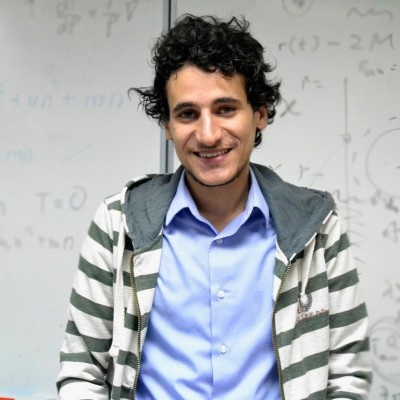

#**Ahmed Nady**

cité du colombier, 49000 Angers    
ahmed.nadi93@yahoo.com
[Visit Linkedin](https://www.linkedin.com/in/ahmed-nady-5b3748248/)

**Formations**

*2012-2013 : Études de troisième cycle en physique, Beni-Suef University, Egypte
*2007-2011 : Licence ès Sciences en physique & chimie (_Félicitations du jury - Major de
            promotion_), Beni-Suef University, Egypte
                          
**Expérience professionnelle**

1.	Chercheur [2023-2024]
**CNRS, CIMAP, Caen, France**
2.	Enseignant [2022-2023]
**ESAIP (école d'ingénieurs), Angers, France** 
3.	Chercheur [2019-2021]
**Laboratoire de Photonique d’Angers, Université d’Angers, France**
4.	Chercheur [2015-2016] 
**Quantum and Laser Science Lab, University of Malaya, Malaysia** 

**Intérêts**

*Droit
*Littérature
*Philosophie 
